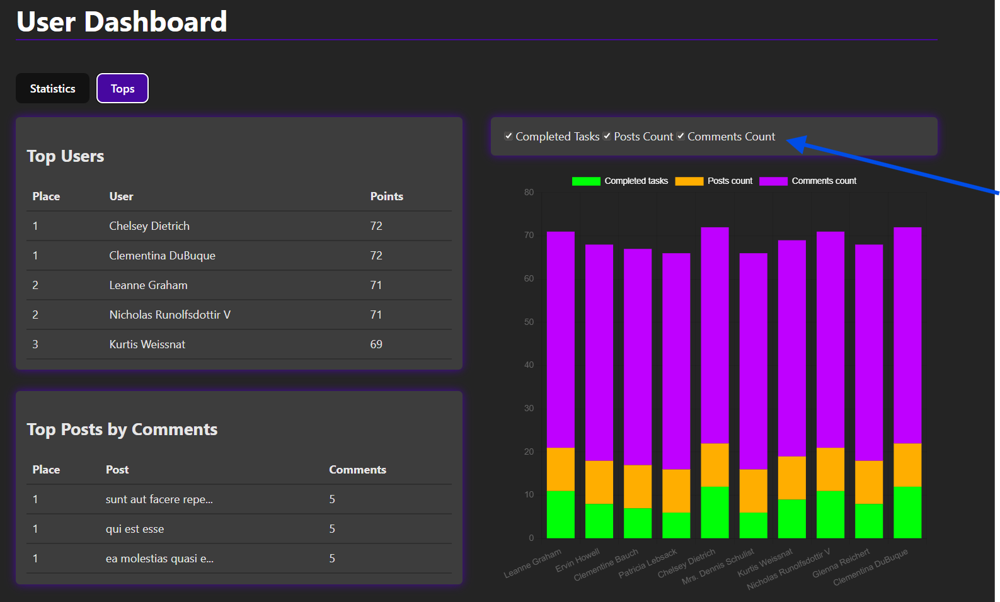

<<<<<<< HEAD
Jest to strona, która pobiera dane z publicznego API i analizuje je, prezentując w przystępny sposób. Strona jest podzielona na dwie podstrony.

Pierwsza podstrona pokazuje statystyki danych, gdzie możemy zobaczyć takie metryki jak:
• średnia liczba zadań przypadających na użytkownika,
• średnia liczba wykonanych zadań przez użytkownika,
• średnia liczba niewykonanych zadań przez użytkownika,
• średnia liczba postów przypadających na użytkownika,
• średnia liczba komentarzy do postów.

Na tej podstronie znajduje się również wykres kołowy, który pokazuje stosunek wykonanych do niewykonanych zadań dla każdego użytkownika.

Druga podstrona dotyczy rankingów. Pokazuje ranking użytkowników według:
• liczby wykonanych zadań,
• liczby opublikowanych postów,
• liczby komentarzy do postów.

Na podstawie tego rankingu dostępny jest również wykres słupkowy dla wszystkich użytkowników, którego parametry można dostosować. Dodatkowo możemy zobaczyć ranking postów według największej liczby komentarzy.

Wykorzystałam AI do:
- wyboru odpowiedniego języka programowania i narzędzi potrzebnych do mojego projektu,
- rozplanowania projektu krok po kroku,
- edukacji i nauki nowych bibliotek, na przykład Chart.js,
- generowania przykładowych fragmentów kodu w bibliotece Chart.js, które potem dostosowywałam do swoich potrzeb,
- pisania poszczególnych części kodu, np. do przypisania odpowiednich miejsc użytkownikom w rankingu czy tworzenia checkboxów dla wykresu słupkowego,
- rozwiązywania problemów i wyjaśniania błędów, które pojawiały się podczas pisania kodu,
- uczynienia mojego kodu bardziej przejrzystym i czytelnym,
- skrócenia niektórych fragmentów kodu.
=======
# Analytic-page
>>>>>>> dfc9b80f60a1bfe5da4b15e5c33d2b280f03c9f5
